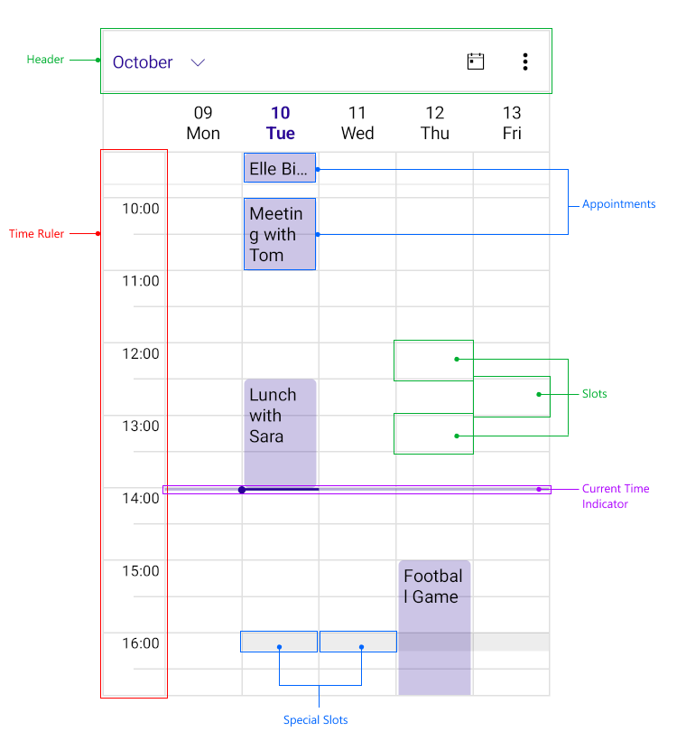

# .NET MAUI Scheduler Visual Structure

The visual structure of the .NET MAUI Scheduler represents the anatomy of the UI component. Being familiar with the visual elements of the Scheduler control allows you to quickly find the information required to configure them.

The following image shows the anatomy of the Scheduler control.

## Displayed Elements

* **Header**&mdash;Used to quickly switch between the available views as well as navigate to a different date. 
* **Time Ruler**&mdash;Represents the time axis of the Scheduler view.
* **Current Time Indicator**&mdash;Indicates the current time.
* **Appointment**&mdash;Represents a single piece of data that is visualized in the Scheduler.
* **Slot**&mdash;Represents the timeslots of the control defined by the TimeRuler.
* **Special Slot**&mdash;Represents the hightlighted state of the Slot.

## See Also

- [Telerik .NET MAUI Blogs](https://www.telerik.com/blogs/mobile-net-maui)
- [Telerik .NET MAUI Roadmap](https://www.telerik.com/support/whats-new/maui-ui/roadmap)