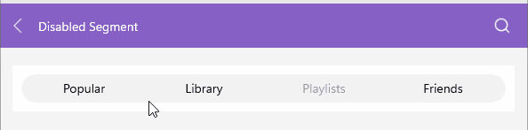

# .NET MAUI SegmentedControl Keyboard Support on Desktop

The [Telerik UI for .NET MAUI SegmentedControl]() provides keyboard navigation support on WinUI and MacCatalyst.

| Hotkey | Action |
| ------ | ------ |
| `Tab` | Enters or exits the SegmentedControl and navigates between segments. |
| `Shift` + `Tab` | Enters or exits the SegmentedControl. |
| `Left Arrow` | Navigates to the previous item in the SegmentedControl. |
| `Right Arrow` | Navigates to the next item in the SegmentedControl. |
| `Enter` | Selects the currently focused segment. |

Here is how the keyboard navigation support looks on WinUI:

## See Also

- [Data Binding]()
- [Size Mode]()
- [Selection]()
- [Disabled Segments]()
- [Styling]()