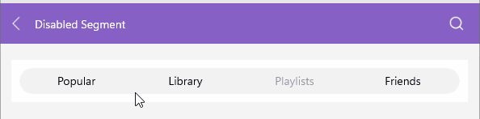

# .NET MAUI SegmentedControl Keyboard Navigation Support on Desktop

The [Telerik UI for .NET MAUI SegmentedControl]() provides keyboard navigation support on WinUI and MacCatalyst.

The table below lists the available keyboard combinations and their corresponding actions:

| Hotkey | Action |
| ------ | ------ |
| `Tab` | Enters or exits the SegmentedControl and navigates between segments. |
| `Shift` + `Tab` | Enters or exits the SegmentedControl. |
| `Left Arrow` | Navigates to the previous item in the SegmentedControl. |
| `Right Arrow` | Navigates to the next item in the SegmentedControl. |
| `Enter` | Selects the currently focused segment. |

## Track the Current and Selected Items

During keyboard navigation, the `CurrentItem` property identifies the segment that currently has keyboard focus. The `SelectedItem` property identifies the committed selection. Arrow keys can change `CurrentItem` without changing `SelectedItem`; pressing `Enter` or `Space` selects the current segment.

The SegmentedControl does not expose a dedicated `CurrentItemChanged` event. To observe changes to the current item in code, handle the control's `PropertyChanged` event and check for the `CurrentItem` property name:

```csharp
private void OnSegmentedControlPropertyChanged(object sender, System.ComponentModel.PropertyChangedEventArgs e)
{
	if (e.PropertyName == nameof(RadSegmentedControl.CurrentItem) && sender is RadSegmentedControl segmentedControl)
	{
		object currentItem = segmentedControl.CurrentItem;
	}
}
```

You can also bind `CurrentItem` to a view-model property. Use the `SelectionChanged` event to respond to changes in the committed selection.

Here is how the keyboard navigation support looks on WinUI:



## See Also

- [Data Binding]()
- [Size Mode]()
- [Selection]()
- [Disabled Segments]()
- [Styling]()