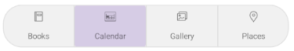
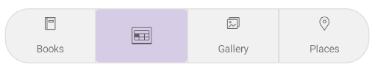

# .NET MAUI SegmentedControl Data Binding

For all cases where the business items are not simple strings, data-binding is necessary to correctly visualize information. The SegmentedControl for .NET MAUI component supports data binding in the form of a path property.

## Populate with Data

- `ItemsSource` (`IEnumerable`)&mdash;Defines the collection of the items that will populate the control with data. The control supports both observable and static collections.
- `DisplayMemberPath` (`string`)&mdash;Defines the name of the property which will be visualized inside each segment.

> If `DisplayMemberPath` is not set the `ToString` implementation of the business object will be visualized. The `DisplayMemberPath` is a property that helps the developers to visualize an exact property from the business object they are bound to.

The following example demonstrates how to bind the `ItemsSource` of the control and specify the property used for display:

**1.** Define a model class:

<snippet id='segmentedcontrol-segmentitem' />

**2.** Define a `ViewModel` that exposes a collection of items:

<snippet id='segmentedcontrol-viewmodel' />

**3.** Bind the `ItemsSource` of the control and specify the property used for display:

<snippet id='segmentedcontrol-databinding-displaymemberpath' />

This is the result:


## Define Item Appearance

The SegmentedControl provides a default appearance of the segments. If you want to customize this appearance, define an `ItemTemplate` (`DataTemplate`).

Here is an example with `ItemTemplate`:

**1.** Create a sample model:

<snippet id='segmentedcontrol-segmentitem' />

**2.** Create a `ViewModel`:

<snippet id='segmentedcontrol-viewmodel' />

**3.** Define the SegmentedControl with a sample `ItemTemplate`:

<snippet id='segmentedcontrol-databinding-itemtemplate' />

**4.** Add a style for the selected segment:

<snippet id='segmentedcontrol-databinding-selectionindicator' />

**4.** Add the `telerik` namespace:

```XAML
xmlns:telerik="http://schemas.telerik.com/2022/xaml/maui"
```

This is the result:



## Item Appearance at Runtime

When the SegmentedControl is bound to a collection of multiple data item objects and the appearance of each segment depends on a specific property of the business object then you can define an item appearance at runtime by setting the `ItemTemplate` property to a `DataTemplateSelector` object.

**1.** Define the data templates and the selector:

<snippet id='segmentedcontrol-datatemplatetypes' />

**2.** Implement the `DataTemplateSelector`:

<snippet id='segmentedcontrol-datatemplateselector' />

**3.** Apply the selector to the `ItemTemplate` of the control:

<snippet id='segmentedcontrol-databinding-itemtemplate-selector' />

**4.** Add a sample model:

<snippet id='segmentedcontrol-segmentitem' />

**5.** Create a `ViewModel`:

<snippet id='segmentedcontrol-viewmodel' />

**6.** Add the `telerik` namespace:

```XAML
xmlns:telerik="http://schemas.telerik.com/2022/xaml/maui"
```

This is the result:



>tip For a runnable example demonstrating the SegmentedControl data-binding scenarios, see the [SDKBrowser Demo Application]() and go to the **SegmentedControl > Data Binding** category.

## See Also

- [Size Mode]()
- [Selection]()
- [Item Tapped]()
- [Disabled Segments]()
- [Styling]()

