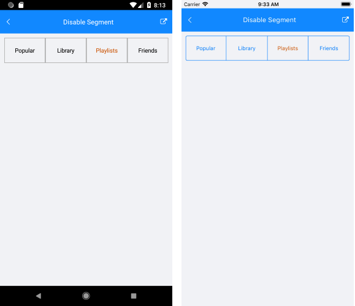

# Disabled Segments

The SegmentedControl allows you to disable each of its segments individually.

To disable a segment, use the `SetSegmentEnabled` method, which accepts the following arguments:

* `index` determines the index of the segment.
* `isEnabled` determines whether the item is enabled or not.

You can also check if an item is enabled through the `IsSegmentEnabled` method. The method accepts a single `index` argument.

## Setting the Text Color

You can set the text color of the disabled segment through the `DisabledSegmentTextColor`.

### Example

The following example shows how to disable a segment and define a color.

```XAML
<telerikInput:RadSegmentedControl x:Name="segmentControl"
                                  DisabledSegmentTextColor="#CA5100"
                                  HeightRequest="60"
                                  VerticalOptions="Start">
    <telerikInput:RadSegmentedControl.ItemsSource>
        <x:Array Type="{x:Type x:String}">
            <x:String>Popular</x:String>
            <x:String>Library</x:String>
            <x:String>Playlists</x:String>
            <x:String>Friends</x:String>
        </x:Array>
    </telerikInput:RadSegmentedControl.ItemsSource>
</telerikInput:RadSegmentedControl>
```

You can disable any segment with `SetSegmentEnabled` method:

```C#
this.segmentControl.SetSegmentEnabled(2, false);
```


The following image shows the end result.



## See Also

- [Customizing the Segment Colors]()
