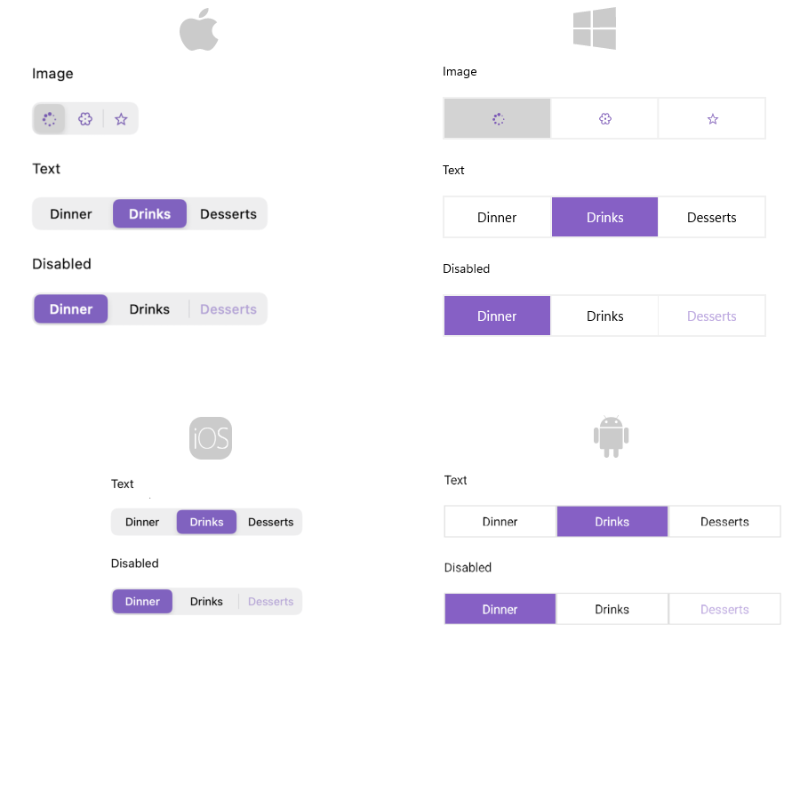

# .NET MAUI SegmentedControl Overview

The Telerik UI for .NET MAUI SegmentedControl allows you to display a list of horizontally aligned, mutually exclusive options, which can be selected by the user. Each option is rendered as a button that can display text, an image, or custom content.

## Key Features of the .NET MAUI SegmentedControl

* [Data binding]()&mdash;Populate the control with a collection of business objects by using the `ItemsSource` property and visualize the data through `DisplayMemberPath`, a custom `ItemTemplate`, or a `DataTemplateSelector`.
* [Size mode]()&mdash;Configure how each segment sizes itself within the control through the `SizeMode` property of the item view, which supports `Star`, `Auto`, and `Fixed` sizing.
* [Selection]()&mdash;Select segments programmatically or through user interaction by using the `SelectedIndex` and `SelectedItem` properties. The control supports `Single`, `SingleDeselect`, and `None` selection modes and raises a `SelectionChanged` event.
* [Item tapped]()&mdash;Respond to tap interactions on the segments through the `ItemTapped` event and the `ItemTappedCommand` command, regardless of the current selection.
* [Disabling segments]()&mdash;Disable the interactions with a specific segment by using the `SetSegmentEnabled` method and check the current state through the `IsSegmentEnabled` method.
* [Styling]()&mdash;Customize the appearance of the segments, the selection indicator, and the separators between segments through the `ItemViewStyle`, `ItemViewStyleSelector`, `SelectionIndicatorStyle`, and `SeparatorStyle` properties.

## Next Steps

- [Getting Started with Telerik UI for .NET MAUI SegmentedControl]()

## See Also

- [.NET MAUI SegmentedControl Product Page](https://www.telerik.com/maui-ui/segmented-control)
- [.NET MAUI SegmentedControl Forum Page](https://www.telerik.com/forums/maui?tagId=1785)
- [Telerik .NET MAUI Blogs](https://www.telerik.com/blogs/mobile-net-maui)
- [Telerik .NET MAUI Roadmap](https://www.telerik.com/support/whats-new/maui-ui/roadmap)