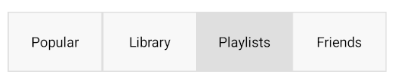

# Selection in .NET MAUI SegmentedControl

The SegmentedControl exposes properties, which can help you work with the items selection.

## Main Properties

* `SelectedIndex`(`int`): Specifies the index of the first item in the current selection or -1 if the selection is empty.
* `SelectedItem`(`object`): Defines the first item in the current selection, or null if the selection is empty.

## Events

The SegmentedControl exposes a `SelectionChanged` event, which is fired when the selected item is programmatically changed or updated due to user interaction.

The `SelectionChanged` event handler receives two parameters:
* The sender argument, which is of type `object`, but can be cast to the `RadSegmentedControl` type.
* A `ValueChangedEventArgs&lt;int&gt;` object, which provides the old and new value of the `SelectedIndex`.

## Style the currently selected item

You can define custom colors for the text and the background of the selected segment by using the `SelectedSegmentBackgroundColor` and `SelectedSegmentTextColor` properties of the SegmentedControl.

## Example

The following example demonstrates how to use the selection feature of SegmentedControl.

**1.** Create a `ViewModel` with a `SelectedItem` property bound to the `SelectedItem` property of the SegmentedControl:

<snippet id='segmentcontrol-selection-viewmodel' />

**2.** Add the SegmentedControl definition in XAML:

<snippet id='segmentcontrol-selection-xaml' />

**3.** Set the `BindingContext` of the control:

<snippet id='segmentcontrol-selection-bindingcontext' />

**4.** Add the SegmentedControl `SelectionChanged` event:

<snippet id='segmentcontrol-selection-event' />

The image below shows the end result on different platforms:

## See Also

- [Customizing the Segment Colors]()
