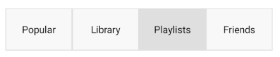

# Selection in .NET MAUI SegmentedControl

The SegmentedControl exposes a rich set of properties, events, and commands for working with the selection of its segments.

## Selection Properties

The SegmentedControl provides the following properties for working with the current selection:

* `SelectedIndex` (`int`)&mdash;Specifies the index of the first item in the current selection, or `-1` if the selection is empty.
* `SelectedItem` (`object`)&mdash;Defines the first item in the current selection, or `null` if the selection is empty.

## Selection Modes

The segment selection behavior is defined by the `SelectionMode` (`Telerik.Maui.Controls.SegmentedControl.SegmentedControlSelectionMode`) property, which determines how items can be selected by user interaction. The control supports three selection modes:

* (Default) `Single`&mdash;Only one segment can be selected at a time. Tapping the selected segment again keeps it selected.
* `SingleDeselect`&mdash;Only one segment can be selected at a time. Tapping the selected segment again deselects it.
* `None`&mdash;Tapping a segment performs no selection. Programmatic values assigned to `SelectedIndex` and `SelectedItem` are coerced to `-1` and `null`, respectively.

## Selection Event

The SegmentedControl raises the `SelectionChanged` event when the current selection changes, either programmatically or as a result of user interaction. The event handler receives a `RadSelectionChangedEventArgs` argument that exposes the added and removed items.

> To respond to tap interactions regardless of the current selection, use the `ItemTapped` event or the `ItemTappedCommand` command. For more information, see the [Item Tapped]() article.

## Example

The following example demonstrates how to use the selection feature of the SegmentedControl.

**1.** Create a `ViewModel` with `SelectedItem` and `SelectedIndex` properties bound to the SegmentedControl:

<snippet id='segmentcontrol-selection-viewmodel' />

**2.** Add the SegmentedControl definition in XAML:

<snippet id='segmentcontrol-selection-xaml' />

**3.** Set the `BindingContext` of the control:

<snippet id='segmentcontrol-selection-bindingcontext' />

**4.** Handle the SegmentedControl `SelectionChanged` event:

<snippet id='segmentcontrol-selection-event' />

This is the result:

>tip For a runnable example demonstrating the SegmentedControl Selection scenarios, see the [SDKBrowser Demo Application]() and go to the **SegmentedControl > Selection** category.

## See Also

- [Data Binding]()
- [Size Mode]()
- [Item Tapped]()
- [Disabled Segments]()
- [Styling]()
