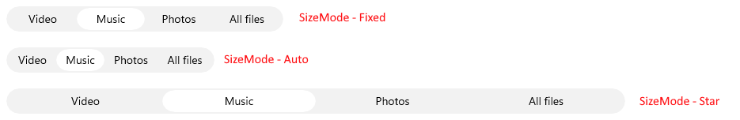

# .NET MAUI SegmentedControl Size Mode

The SegmentedControl allows you to control how each segment sizes itself within the control through the `SizeMode` property of the `RadSegmentedControlItemView`.

The `SizeMode` property is of type `Telerik.Maui.Controls.SegmentedControl.SegmentedControlSizeMode` and supports the following values:

* (Default) `Star`&mdash;The segment takes an equal share of the remaining width after `Fixed` and `Auto` segments are sized.
* `Auto`&mdash;The segment sizes itself to its desired (content-driven) width.
* `Fixed`&mdash;The segment uses its `WidthRequest`, optionally clamped by `MinimumWidthRequest` and `MaximumWidthRequest` when those are explicitly set.

The `SizeMode` can be applied to all segments through an `ItemViewStyle` that targets `RadSegmentedControlItemView`.

The following example demonstrates how to apply the `Star` size mode to all segments:

<snippet id='segmentcontrol-sizemode-star-xaml' />

The following example demonstrates how to apply the `Fixed` size mode to all segments:

<snippet id='segmentcontrol-sizemode-fixed-xaml' />

The following example demonstrates how to apply the `Auto` size mode to all segments:

<snippet id='segmentcontrol-sizemode-auto-xaml' />

>tip For a runnable example demonstrating the SegmentedControl Size Mode options, see the [SDKBrowser Demo Application]() and go to the **SegmentedControl > Size Mode** category.

## See Also

- [Data Binding]()
- [Selection]()
- [Item Tapped]()
- [Disabled Segments]()
- [Styling]()
