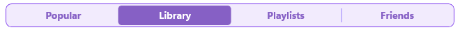

# .NET MAUI SegmentedControl Styling

The SegmentedControl provides a set of styling properties that allow you to customize the appearance of the segments, the selection indicator, and the separators between segments. The actual style that is applied to each visual element is a merger between the custom style and the default style.

## Styling Properties

The SegmentedControl exposes the following styling properties:

* `ItemViewStyle` (`Style` with target type of `RadSegmentedControlItemView`)&mdash;Defines the style applied uniformly to each segment item view.
* `ItemViewStyleSelector` (`IStyleSelector`)&mdash;Provides per-item style logic for `RadSegmentedControlItemView` instances. When set, the selector is invoked with the business item and the container view to determine the applied style.
* `SelectionIndicatorStyle` (`Style` with target type of `RadBorder`)&mdash;Defines the style applied to the visual selection indicator.
* `SeparatorStyle` (`Style` with target type of `RadBorder`)&mdash;Defines the style applied to the separator rectangle rendered between adjacent segments.

In addition to the styling properties above, the SegmentedControl inherits from `RadBorder`, so you can customize the surrounding frame by setting the `BorderColor`, `BackgroundColor`, `BorderThickness`, `CornerRadius`, and `Padding` properties directly on the control.

## Style the Segment Item

The `RadSegmentedControlItemView` exposes a number of bindable properties that can be set through the `ItemViewStyle` property of the SegmentedControl:

* `TextColor` (`Color`)&mdash;Define the color of the text in the unselected state.
* `SelectedTextColor` (`Color`)&mdash;Define the color of the text in the selected state.
* `BackgroundColor` (`Color`)&mdash;Define the background color of the segment in the unselected state.
* `BorderColor` (`Color`)&mdash;Define the border color of the segment in the unselected state.
* `BorderThickness` (`Thickness`)&mdash;Define the border thickness of the segment.
* `CornerRadius` (`CornerRadius`)&mdash;Defines the corner radius of the segment.
* `Padding` (`Thickness`)&mdash;Defines the padding inside the segment.
* Font Options&mdash;Define the `FontSize`, `FontFamily`, `FontAttributes` properties to customize the font of the segment text.
* `HorizontalTextAlignment` (`TextAlignment`)&mdash;Define the horizontal alignment of the text.
* `VerticalTextAlignment` (`TextAlignment`)&mdash;Define the vertical alignment of the text.
* `SizeMode` (`SegmentedControlSizeMode`)&mdash;Defines how the segment sizes itself. For more information, see the [Size Mode]() article.

The following example demonstrates how to apply a style to the segments:

<snippet id='segmentcontrol-item-segment-style-xaml' />

## Style the Selection Indicator

Customize the selection indicator by providing a `Style` targeting `RadBorder`:

<snippet id='segmentcontrol-selected-segment-style-xaml' />

## Style the Separator

Customize the separator between segments by providing a `Style` targeting `RadBorder`:

<snippet id='segmentcontrol-separator-style-xaml' />

## Example

Apply the defined styles to the SegmentedControl through its `ItemViewStyle`, `SelectionIndicatorStyle`, and `SeparatorStyle` properties:

<snippet id='segmentcontrol-styling-xaml' />

The following image shows the end result:

## Example with Style Selector

When segments need to be styled differently based on their data, use the `ItemViewStyleSelector` property to assign a style on a per-item basis.

**1.** Define the styles and the style selector in the resources:

<snippet id='segmentedcontrol-styleselector-definition-xaml' />

**2.** Implement the `IStyleSelector`:

<snippet id='segmentedcontrol-styleselector' />

**3.** Apply the selector to the SegmentedControl:

<snippet id='segmentedcontrol-styleselector-xaml' />

This is the result:

>tip For runnable examples demonstrating the SegmentedControl Styling options, see the [SDKBrowser Demo Application]() and go to the **SegmentedControl > Styling** category.

## See Also

- [Getting Started]()
- [Data Binding]()
- [Size Mode]()
- [Selection]()
- [Disabled Segments]()
