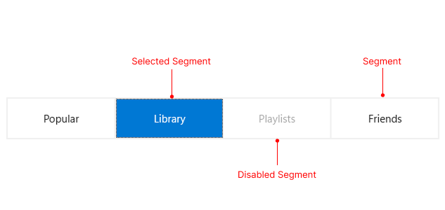

# .NET MAUI SegmentedControl Visual Structure

The visual structure of the .NET MAUI SegmentedControl represents the anatomy of the UI control. Being familiar with the visual elements of the SegmentedControl allows you to quickly find the information required to configure them.

The following image shows the anatomy of the SegmentedControl.

## Displayed Elements

- **Segment**&mdash;Represents a segment in the SegmentedControl.
- **Selected Segment**&mdash;Represents the selection in the SegmentedControl when selecting a segment. 
- **Disabled Segment**&mdash;Represents a disabled segment in the SegmentedControl.

## See Also

- [Getting Started with .NET MAUI SegmentedControl]()
- [Selection]()
- [Disabled Segments]()