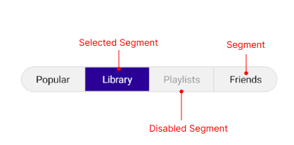

# .NET MAUI SegmentedControl Visual Structure

The visual structure of the .NET MAUI SegmentedControl represents the anatomy of the UI control. Being familiar with the visual elements of the SegmentedControl allows you to quickly find the information required to configure them.

The following image shows the anatomy of the SegmentedControl.

## Displayed Elements

- **Segment**&mdash;Represents a single item in the SegmentedControl. Each segment is rendered by a `RadSegmentedControlItemView` and can be styled through the `ItemViewStyle` or the `ItemViewStyleSelector` properties of the control.
- **Selected Segment**&mdash;Represents the visual indicator that highlights the currently selected segment. It can be styled through the `SelectionIndicatorStyle` property.
- **Separator**&mdash;Represents the visual separator rendered between two consecutive segments. It can be styled through the `SeparatorStyle` property.
- **Disabled Segment**&mdash;Represents a segment whose interactions are disabled through the `SetSegmentEnabled` method.

## See Also

- [Getting Started with .NET MAUI SegmentedControl]()
- [Data Binding]()
- [Size Mode]()
- [Selection]()
- [Disabled Segments]()
- [Styling]()