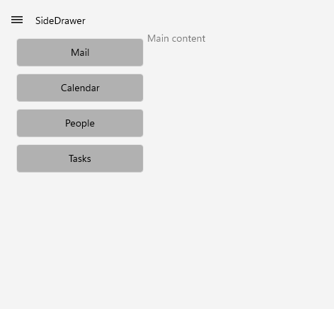
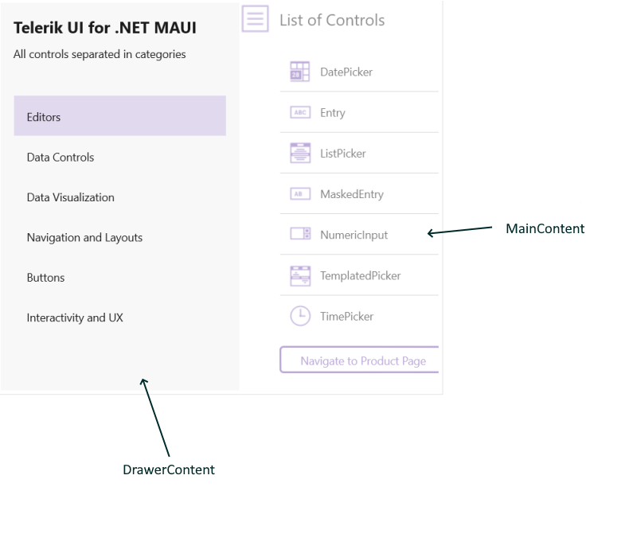

# Getting Started with .NET MAUI SideDrawer

This guide provides the information you need to start using the Telerik UI for .NET MAUI SideDrawer by adding the control to your project.

At the end, you will be able to achieve the following result.



## Prerequisites

Before adding the TemplatedPicker, you need to:

1. [Set up your .NET MAUI application](#set-up-your-net-maui-application).

1. [Download Telerik UI for .NET MAUI](#download-telerik-ui-for-net-maui).

1. [Install Telerik UI for .NET MAUI](#install-telerik-ui-for-net-maui).

## Define the Control

The SideDrawer control contains two views - `MainContent` and `DrawerContent` The `DrawerContent` represents the hidden view (in it you can place navigational UI, any common setting, etc), while the `MainContent` hosts the main `View`.



1. When your .NET MAUI application is set up, you are ready to add a SideDrawer control to your page. The following example demonstrates how to define the `MainContent` and `DrawerContent` of the control.


 <snippet id='sidedrawer-gettingstarted-xaml'/>

1. Add the following namespace:

 ```XAML
xmlns:telerik="http://schemas.telerik.com/2022/xaml/maui" 
 ```

1. Add the DefaultButtonStyle to the VerticalStackLayout's Resources.

```XAML
<telerik:RadSideDrawer x:Name="drawer" 
                       DrawerLength="200">
    <telerik:RadSideDrawer.MainContent>
        <Grid>
            <Label Text="Main content" />
        </Grid>
    </telerik:RadSideDrawer.MainContent>
    <telerik:RadSideDrawer.DrawerContent>
        <VerticalStackLayout Spacing="10"
                             Padding="10, 10, 0, 0">
            <VerticalStackLayout.Resources>
	        <!-- A button style for only DrawerContent -->
                <Style x:Key="DefaultButtonStyle" TargetType="Button">
                    <Setter Property="WidthRequest" Value="180" />
                    <Setter Property="HeightRequest" Value="40" />
                    <Setter Property="BackgroundColor" Value="#b1b1b1" />
                    <Setter Property="TextColor" Value="Black" />
                </Style>
            </VerticalStackLayout.Resources>

            <Button Text="Mail"
                    Style="{StaticResource DefaultButtonStyle}" />
            <Button Text="Calendar"
                    Style="{StaticResource DefaultButtonStyle}" />
            <Button Text="People"
                    Style="{StaticResource DefaultButtonStyle}" />
            <Button Text="Tasks"
                    Style="{StaticResource DefaultButtonStyle}" />
        </VerticalStackLayout>
    </telerik:RadSideDrawer.DrawerContent>
</telerik:RadSideDrawer>
```

1. Register the Telerik controls through the `Telerik.Maui.Controls.Compatibility.UseTelerik` extension method called inside the `CreateMauiApp` method of the `MauiProgram.cs` file of your project:

 ```C#
 using Telerik.Maui.Controls.Compatibility;

 public static class MauiProgram
 {
	public static MauiApp CreateMauiApp()
	{
		var builder = MauiApp.CreateBuilder();
		builder
			.UseTelerik()
			.UseMauiApp<App>()
			.ConfigureFonts(fonts =>
			{
				fonts.AddFont("OpenSans-Regular.ttf", "OpenSansRegular");
			});

		return builder.Build();
	}
 }           
 ```           
 
## Additional Resources

- [.NET MAUI SideDrawer forum page](https://www.telerik.com/forums/maui?tagId=1938)
- [Telerik .NET MAUI blogs](https://www.telerik.com/blogs/mobile-net-maui)
- [Telerik .NET MAUI roadmap](https://www.telerik.com/support/whats-new/maui-ui/roadmap)

## See Also

- [Configuration]()
- [Commands]()
- [Events]()
- [Transitions]()
