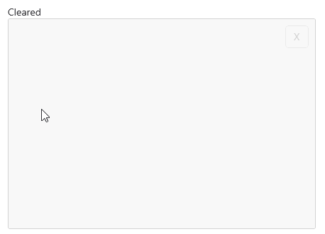

# .NET MAUI SignaturePad Events

The SignaturePad for .NET MAUI exposes the following events: 

* `StrokeStarted` event is raised when a new stroke is started. The `StrokeStarted` event handler receives two parameters: 
	* The `Sender` which is of type `Telerik.Maui.Controls.RadSignaturePad`. 
	* and `EventArgs` 

* `StrokeCompleted` event is raised when a new stroke is completed. The `StrokeCompleted` event handler receives two parameters:
	* The `Sender` which is of type `Telerik.Maui.Controls.RadSignaturePad`.
	* and `EventArgs` 

* `Cleared` event is raised when the surface of `Telerik.Maui.Controls.RadSignaturePad` is cleared.

## Example

The example contains an **X** Button, two Labels and a `RadSignaturePad`. 

**1.** The control's definition in XAML:

<snippet id='signaturepad-events'/>

**2.** Add the `telerik` namespace: 

```XAML
xmlns:telerik="http://schemas.telerik.com/2022/xaml/maui"
```

**3.** Add the events:

The `RadSignaturePad.StrokeStarted` event. When stroke starts we will display a timestamp using a Label:

<snippet id='signaturepad-strokestarted-event'/>

The `RadSignaturePad.StrokeCompleted` event. When stroke completes the timestamp Label text is updated.

<snippet id='signaturepad-strokecompleted-event'/>

The `SignaturePad.Cleared` event, When `Cleared` event is fired, Label with `Text="Cleared"` is displayed.

<snippet id='signaturepad-cleared-event'/>



>important For the SignaturePad Events example refer to the [SDKBrowser Demo Application]().

## See Also

- [Configure the Signature]()
- [Commands]()
- [Save Signature]()