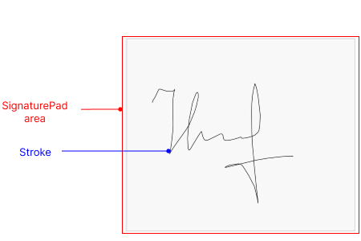

# .NET MAUI SignaturePad Visual Structure

The visual structure of the .NET MAUI SignaturePad represents the anatomy of the UI component. Being familiar with the visual elements of the SignaturePad allows you to quickly find the information required to configure them.

The following image shows the anatomy of the SignaturePad.

## Displayed Elements

* **SignaturePad area**&mdash;The area where the user can draw their signature.
* **Stroke**&mdash;The line drawn by the user inside the SignaturePad area.

## See Also

* [Getting Started]()
* [SignaturePad Configuration]()
* [SignaturePad Saving Options]()