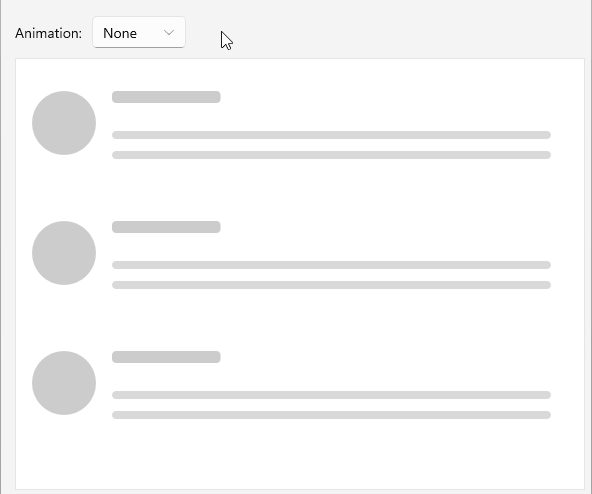

# .NET MAUI Skeleton Animation

The Skeleton control includes built-in animation options that allow you to create a smooth and engaging loading experience for the app users.

You can change the animation type by setting the `AnimationType` (`enum` of type `Telerik.Maui.Controls.Skeleton.SkeletonAnimationType`) property to one of the available options:

* `None`&mdash;No animation is applied to the Skeleton control. The skeleton remains static without any visual effects.
* (Default) `Pulse`&mdash;Applies a pulsing animation that smoothly fades the skeleton in and out, creating a subtle breathing effect. This is the default animation type and provides visual feedback that content is actively loading.

Check below a quick example on how to set the `AnimationType` property to `None`:

<snippet id='skeleton-animation-type' />

> For a runnable example with the Skeleton Animation, see the [SDKBrowser Demo Application]() and go to **Skeleton > Animation** category.

## See Also

- [Built-in Views]()
- [Configuration]()
- [Custom Views]()
- [Styling]()
