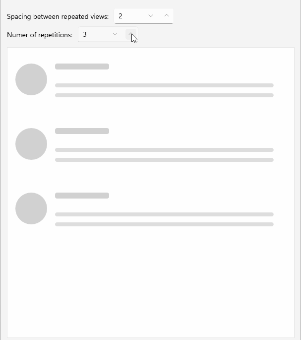

# .NET MAUI Skeleton Configuration

The Telerik UI for .NET MAUI Skeleton control provides a variety of properties that allow you to configure its appearance and behavior to fit your application's needs. 

## Loading

The `IsLoading` (`bool`) property indicates whether the content of the Skeleton control is currently in a loading state. When set to `true`, the skeleton view is displayed, simulating the loading of content. When set to `false`, the actual content is shown. The default value is `true`.

## Width and Height

The Skeleton allows you to specify the size of the loading view by using the following properties:

* `LoadingViewMinimumHeight` (`double`)&mdash;Specifies the minimum height of the Skeleton loading view. The default value is `64`.
* `LoadingViewMinimumWidth` (`double`)&mdash;Specifies the minimum width of the Skeleton loading view. The default value is `64`.

## Repeat Count

The `RepeatCount` (`int`) property allows you to specify how many times the loading view should be repeated. This is useful for creating a list of skeleton items that mimic the structure of the actual content. The default value is `1`, meaning the loading view is displayed only once.

In addition, you can apply spacing between the repeated skeleton views by setting the `RepeatSpacing` (`double`) property. The default value is `10`.

Check below a quick example on how to set the `RepeatCount` and `RepeatSpacing` properties:

<snippet id='skeleton-repeat' />

This is the result:

> For a runnable example with the Skeleton Repeat Count scenario, see the [SDKBrowser Demo Application]() and go to **Skeleton > Repeat Count** category.

## See Also

- [Built-in Views]()
- [Animation]()
- [Custom Views]()
- [Styling]()
