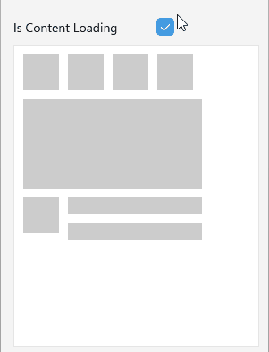
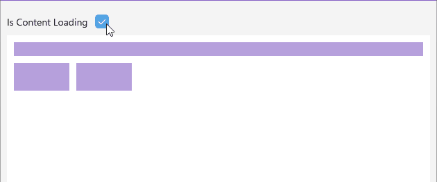

# .NET MAUI Skeleton Custom View

The Telerik UI for .NET MAUI Skeleton control allows you to create custom skeleton views to match the specific design and layout of your application. 

This is particularly useful when the built-in skeleton types do not fit your requirements.

## Custom Template

To create a custom skeleton view, you can define your own layout using XAML or C# and set it to the `LoadingViewTemplate` (`DataTemplate`) property of the `RadSkeleton`.

Here is an example of how to define a custom loading template as skeleton view:

1. Define the `RadSkeleton` control: 

<snippet id='skeleton-customview' />

2. Create a custom loading template and set it to the `RadSkeleton.LoadingViewTemplate` property:

<snippet id='skeleton-loadingview-template' />

3. Add the `telerik` namespace:

```XAML
xmlns:telerik="http://schemas.telerik.com/2022/xaml/maui"
```

This is the result:



> For a runnable example with the Skeleton Custom Loading Template scenario, see the [SDKBrowser Demo Application]() and go to **Skeleton > Custom View** category.

## Custom Drawable

You can also create a custom drawable object by implementing the `IDrawable` interface. This allows you to have full control over the appearance and behavior of the skeleton view.

To apply the custom drawable to the `RadSkeleton`, set it to the `LoadingViewDrawable` property.

Here is an example of how to define a custom drawable object as skeleton view:

1. Define the `RadSkeleton` control: 

<snippet id='skeleton-custom-drawable' />

2. Create a custom `MyCustomDrawable` class that inherits from the `IDrawable` interface:

<snippet id='skeleton-custom-drawable-implementation' />

3. Add the `telerik` namespace:

```XAML
xmlns:telerik="http://schemas.telerik.com/2022/xaml/maui"
```

This is the result:



## See Also

- [Built-in Views]()
- [Configuration]()
- [Animation]()
- [Styling]()
