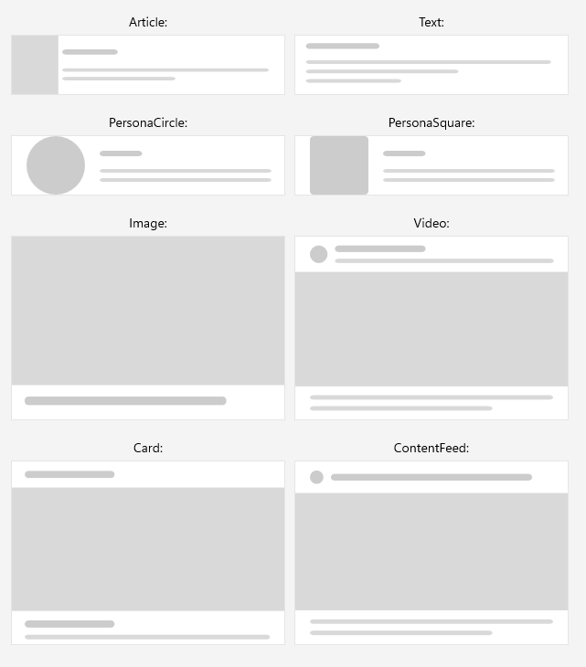
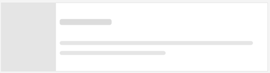

# .NET MAUI Skeleton Built-in Types (Views)

The Telerik UI for .NET MAUI Skeleton control comes with a set of built-in views that you can use to quickly create skeleton screens for common UI elements. 

These built-in views help you to represent the structure and layout of your content while it is being loaded.

You can change the type of the skeleton loading view by setting the `SkeletonType` (`enum` of type `Telerik.Maui.Controls.Skeleton.SkeletonType`) property.

The available built-in types are:

* `Article`&mdash;Displays a skeleton layout suitable for article content, typically showing an image and text lines with varying widths.
* `Text`&mdash;Displays a simple text skeleton with horizontal lines representing text content.
* (Default) `PersonaCircle`&mdash;Displays a persona skeleton with a circular avatar and text lines, commonly used for user profiles or contacts.
* `PersonaSquare`&mdash;Displays a persona skeleton with a square avatar and text lines, an alternative to `PersonaCircle`.
* `Image`&mdash;Displays a skeleton for image-based content, showing a placeholder for an image.
* `Video`&mdash;Displays a skeleton suitable for video content, showing a large rectangular placeholder.
* `Card`&mdash;Displays a card-style skeleton layout with sections for image and text content.
* `ContentFeed`&mdash;Displays a content feed skeleton layout, suitable for social media feeds or news lists.

Check below a quick example on how to set the `SkeletonType` property to `Article`:

<snippet id='skeleton-type' />

This is the result:

> For a runnable example with the Skeleton Built-in Views, see the [SDKBrowser Demo Application]() and go to **Skeleton > Built-in Views** category.

## See Also

- [Configuration]()
- [Animation]()
- [Custom Views]()
- [Styling]()
