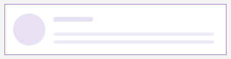

# .NET MAUI Skeleton Styling

The Telerik UI for .NET MAUI Skeleton control provides extensive styling options that allow you to customize its visual appearance to match your application's design.

## Styling Properties

To style the border around the Skeleton, use the following properties:

* `Background` (`Brush`)&mdash;Specifies the background brush of the control.
* `BorderBrush` (`Brush`)&mdash;Specifies the border brush of the control.
* `BorderColor` (`Color`)&mdash;Specifies the border color of the control.
* `BorderThickness` (`Thickness`)&mdash;Specifies the border thickness of the control.
* `CornerRadius` (`CornerRadius`)&mdash;Specifies the corner radius of the control.
* `Padding` (`Thickness`)&mdash;Specifies the padding of the control.

To style the loading view, use the following properties:

* `LoadingViewColor` (`Color`)&mdash;Specifies the base color of the skeleton loading view.

Here is an example of how to style the Skeleton control in XAML:

**1.** Define the Skeleton control in XAML:

<snippet id='skeleton-styling' />

**2.** Add the `telerik` namespace:

```XAML
xmlns:telerik="http://schemas.telerik.com/2022/xaml/maui"
```

This is the result:



> For a runnable example with the Skeleton Styling scenario, see the [SDKBrowser Demo Application]() and go to **Skeleton > Styling** category.


## See Also

- [Built-in Views]()
- [Configuration]()
- [Animation]()
- [Custom Views]()
