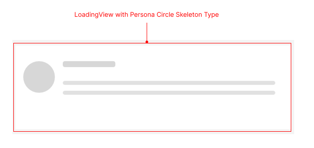

# .NET MAUI Skeleton Visual Structure

The visual structure of the .NET MAUI Skeleton represents the anatomy of the UI component. Being familiar with the visual elements of the Skeleton allows you to quickly find the information required to configure them.

The following image shows the anatomy of the Skeleton.

## Displayed Elements

* **LoadingView with Persona Circle Skeleton Type**&mdash;The circular placeholder that represents a profile picture or avatar while the actual content is loading. For more details for the built-in Skeleton types, refer to the [Skeleton Types]() article.

## See Also

* [Getting Started]()
* [Skeleton Configuration]()
* [Skeleton Built-in Views]()
* [Skeleton Custom Views]()