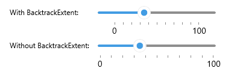

# .NET MAUI Slider Backtrack

The thumb runs along the backtrack of the Slider. The backtrack represents all the values your end users can choose from.

## Minimum and Maximum

You need to configure a `Minimum` value and a `Maximum` value for the Slider. These values define the limits of the backtrack.

* `Minimum`(`double`)&mdash;Defines the minimum value of the slider.
* `Maximum`(`double`)&mdash;Defines the maximum value of the slider.

<snippet id='slider-getting-started-xaml' />

## Backtrack Extent

By default, the backtrack is drawn between the `Minimum` and `Maximum` values. Through the `BacktrackExtent` property you can extend the backtrack at the edges beyond the minimum and the maximum values.

* `BacktrackExtent`(`double`)&mdash;Defines how many pixels beyond the minimum and the maximum values the backtrack will extend. 

```XAML
 <telerik:RadSlider Minimum="0"
                    Maximum="100"
                    Value="35"
                    TickStep="10"
                    TicksPlacement="End"
                    LabelStep="100"
                    LabelsPlacement="End"
                    BackTrackExtent="50"/>
```



## See Also

* [Value Thumb]()
* [Range Track)()
* [Track Styling]()
