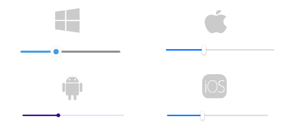

# Getting Started with the .NET MAUI Slider

This guide provides the information you need to start using the Telerik UI for .NET MAUI Slider by adding the control to your project.

At the end, you will achieve the following result.



## Prerequisites

Before adding the Slider, you need to:

1. [Set up your .NET MAUI application](#prerequisites).

1. [Download Telerik UI for .NET MAUI](#step-2-download-your-license-key-file).

1. [Install Telerik UI for .NET MAUI](#step-3-create-a-new-maui-project).

## Define the Control

**1.** When your .NET MAUI application is set up, you are ready to add a Slider control to your page. The following example demonstrates how to define the `RadSlider`:

<snippet id='slider-getting-started-xaml'/>
<snippet id='slider-gettingstarted-csharp'/>

**2.** Add the `telerik` namespace:

```XAML
xmlns:telerik="http://schemas.telerik.com/2022/xaml/maui"
```

**3.** Register the Telerik controls through the `Telerik.Maui.Controls.Compatibility.UseTelerik` extension method called inside the `CreateMauiApp` method of the `MauiProgram.cs` file of your project:

```C#
using Telerik.Maui.Controls.Compatibility;

public static class MauiProgram
{
	public static MauiApp CreateMauiApp()
	{
		var builder = MauiApp.CreateBuilder();
		builder
			.UseTelerik()
			.UseMauiApp<App>()
			.ConfigureFonts(fonts =>
			{
				fonts.AddFont("OpenSans-Regular.ttf", "OpenSansRegular");
			});

		return builder.Build();
	}
}           
```

> For a runnable demo with the Slider Getting Started example, see the [SDKBrowser Demo Application]() and go to the **Slider > Getting Started** category.

## See Also

- [Telerik .NET MAUI Blogs](https://www.telerik.com/blogs/mobile-net-maui)
- [Telerik .NET MAUI Roadmap](https://www.telerik.com/support/whats-new/maui-ui/roadmap)