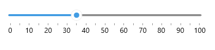
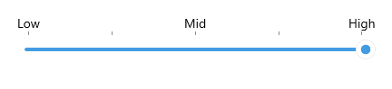
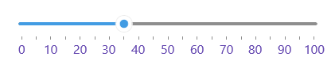

# Labels

The Slider for .NET MAUI can show labels along the backtrack for clarity of what the underlying min-max range is.

## Labels Step and Placement

To display labels, define the `LabelStep` and `LabelPlacement` properties of the Slider.

* `LabelStep`(`double`)&mdash;Defines at what positions/values labels will be displayed.
* `LabelsPlacement`(`Telerik.Maui.Controls.RangeSlider.SliderLabelsPlacement`)&mdash;Specifies the position of the labels in the Slider with respect to its backtrack. The available options are:
    * `None`&mdash;no labels are displayed.
    * `Start`&mdash;labels appear above the track.
    * `End`&mdash;labels appear below the track.

Check an example on how labels can be configured:

<snippet id='slider-labels-settings' />

## Labels Formatting

Through the formatting properties you can easily modify only the labels text by applying a custom format. 

* `StringFormat(string)`&mdash;Defines a custom string format for the labels and the tooltips of the Slider.
* `StringConverter(Telerik.Maui.IStringConverter)`&mdash;Specifies a custom string converter that can be used to define the content of a label or a tooltip for a given range slider value.

Here is a quick example with a custom string converter:

**1.** Add the following sample Dictionary String Converter to your resources&mdash;in short, it replaces the values of the range with meaningful names in order to make the range more readable:

<snippet id='slider-labels-stringconverter-dictionary' />

**2.** Define the Slider with the converter applied:

<snippet id='slider-labels-stringconverter' />

Check the result below:

## Label Template

You can customize what the Slider labels render through the `LabelTemplate` property.

* `LabelTemplate`(`DataTemplate`)&mdash;Defines the template of the Slider labels.

Check below a sample `LabelTemplate` example:

**1.** First define the custom DataTemplate:

<snippet id='slider-labels-labeltemplate' />

**2.** Apply it to the Slider's `LabelTemplate`:

<snippet id='slider-labels-labeltemplate-xaml' />

Here is the result:

## See Also

- [Ticks]()
- [Labels Styling]()