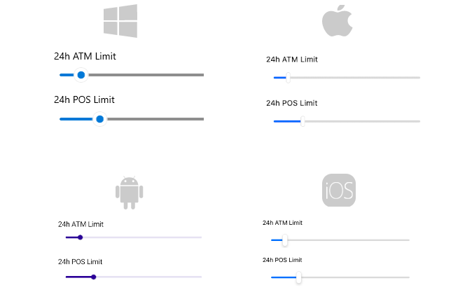

# .NET MAUI Slider Overview

The Telerik UI for .NET MAUI Slider represents a slider component that displays a value in a predefined min-max range. End users can change the selected value by dragging the thumb.

The Slider supports ticks, labels, and tooltips. With them, your end users can quickly identify the min-max range and the currently selected value, and modify them, if needed. 

## Key Features

* [Value thumb]()&mdash;The slider's value thumb is drawn corresponding to its `Value` property. Users can modify the `Value` by dragging the thumb along the backtrack.
* [Range track]()&mdash;The Slider provides a customizable range track for better representation of the selected value. You can modify the range track's initial position with the `OriginValue` property.
* [Backtrack]()&mdash;The thumb runs along the backtrack of the slider. The backtrack represents all the values your end users can choose from.
* [Ticks]()&mdash;Ticks let users easily identify the min-max range.
* [Labels]()&mdash;Labels displayed along the track provide additional clarity about the underlying min-max range.
* [Tooltip]()&mdash;The Slider can show a customizable tooltip to help users choose the desired value with better precision.
* Templates&mdash;The exposed templates let you further customize the look of the Slider's labels, ticks, and tooltip.
* Flexible Styling API&mdash;The Slider provides full control over the appearance of the [thumb](), [track](), [ticks](), and [labels]().

## Next Steps

- [Getting Started with the Telerik UI for .NET MAUI Slider]()
- [.NET MAUI Silder Visual Structure]()
- [.NET MAUI Slider Events](

## See Also

- [Telerik .NET MAUI Blogs](https://www.telerik.com/forums/maui?tagId=2058)
- [Telerik .NET MAUI Roadmap](https://www.telerik.com/support/whats-new/maui-ui/roadmap)
- [Telerik .NET MAUI Demo Apps](https://www.telerik.com/maui-ui/demo-apps)
