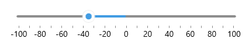

# Range Track

The range track refers to that part of the backtrack between Slider's `OriginValue` and `Value`.

In the common case the range track starts at the backtrack minimum and runs along to the value thumb. You can define a different initial position of the range track through the Slider's `OriginValue` property:

* `OriginValue`(`double`)&mdash;Specifies the value across the backtrack where the range track starts.

Check a quick example on how to define `OriginValue` property, so that the range track starts at the center of the backtrack:

<snippet id='slider-range-track-xaml' />

## See Also

- [Visual Structure]()
- [Backtrack Configuration]()
- [Thumb Styling]()
- [Track Styling]()