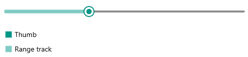

# Thumb Styling

Slider for .NET MAUI provides styling options for its thumb. The thumb can be styled through Fill and Style properties:

* `ThumbFill`(`Color`)&mdash;Applies fill color to the slider's thumb.
* `ThumbStyle`(`Style`)&mdash;Defines a custom style to the slider's thumb.

In addition, you can modify the look &amp; feel of the range track, so it matches the style of the thumb. Range track refers to that part of the backtrack from its start along to the value thumb. 

* `RangeTrackFill`(`Color`)&mdash;Defines fill color to the range track.
* `RangeTrackStyle`(`Style`)&mdash;Applies a custom style to the range track.

Here is a quick example on how the described styling properties can be applied to the Slider:

**1.** Add the styles to the page resources:

<snippet id='slider-value-elements-styling' />

**2.** Define the Slider with the above style properties as well as Fill properties applied:

<snippet id='slider-value-elements-styling-xaml' />

Check the result below:

## See Also

- [Visual Structure]()
- [Value Thumb]()