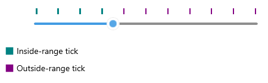
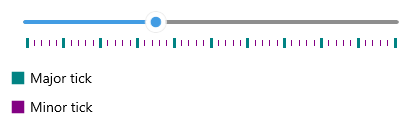

# .NET MAUI Slider Ticks Styling

The Slider for .NET MAUI provides the following styling options and a style selector for the ticks (to let you apply additional styles):

 * `InRangeTickColor`(`Color`)&mdash;Defines the color of the ticks shown along the range track (between `OriginValue` and `Value`).
 * `OutOfRangeTickColor`(`Color`)&mdash;Defines the color of the ticks shown outside of the range track.
 * `TickThickness`(`double`)&mdash;Defines the width of the ticks.
 * `InRangeTickStyle`(`Style`)&mdash;Defines a custom style for the ticks shown along the range track.
 * `OutOfRangeTickStyle`(`Style`)&mdash;Defines a custom style for the ticks shown outside of the range track.
 * `TickLength`(`double`)&mdash;Defines the custom length of the ticks.
 * `TicksStyleSelector`(`Telerik.Maui.Controls.IStyleSelector`)&mdash;Defines a selector that can apply different styles to ticks according to custom logic.

## Tick Styles Example

The following example demonstrates how to use the described styling properties to style the Slider's ticks:

**1.** Add a custom style with `TargetType` set to `RadBorder` to the page's resources:

<snippet id='slider-ticksttyling-styles' />

**2.** Apply the custom styles to the Slider:

<snippet id='slider-ticksttyling-xaml' />

## TickStyleSelector Example

The following example demonstrates how to use the `TicksStyleSelector` to set two different styles for the major and minor ticks:

**1.** Create a custom style selector class that inherits from `Telerik.Maui.Controls.IStyleSelector`:

<snippet id='slider-ticks-styleselector-class' />

>`Telerik.Maui.Controls.IStyleSelector` provides a mechanism to select a `Microsoft.Maui.Controls.Style` based on custom logic.

**2.** Add the style selector to the page's resources:

<snippet id='slider-tickstyleselector-selector'/>

**3.** Apply the style selector to the Slider:

<snippet id='slider-tickstyleselector-xaml'/>

Check the result below:

## See Also

- [Ticks]()
- [Range Track]()
- [Track Styling]()
- [Labels Styling]()