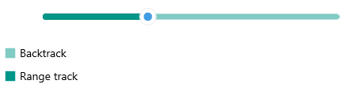

# .NET MAUI Track Styling

The Slider for .NET MAUI provides the following styling options for the backtrack (the track the thumb slides along):

* `BackTrackThickness`(`double`)&mdash;Specifies the thickness of the Slider's backtrack.
* `BackTrackColor`(`Color`)&mdash;Defines the color of the Slider's backtrack.
* `BackTrackStyle`(`Style`)&mdash;Defines a custom style for the Slider's backtrack.

The Slider for .NET MAUI provides the following styling options for the range track (the track between `OriginValue` and `Value`):
 
* `RangeTrackFill`(`Color`)&mdash;Defines the fill color for the Slider's range track.
* `RangeTrackStyle`(`Style`)&mdash;Defines a custom style for the Slider's range track.

The following example demonstrates how to use the described styling properties to style the Slider's backtrack and range track:

**1.** Add a custom style with `TargetType` set to `RadBorder` to the page's resources:

<snippet id='slider-backtrack-style' />

**2.** Add a custom style with `TargetType` set to `SliderRangeTrack` to the page's resources:

<snippet id='slider-rangetrack-style' />

**3.** Apply the custom styles to the Slider:

<snippet id='slider-track-style-xaml' />

Check the result below:

## See Also

- [Backtrack]()
- [Range Track]()
- [Value Thumb]()
