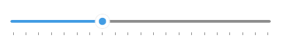
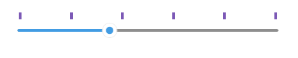

# .NET MAUI Slider Ticks

The Slider for .NET MAUI can show ticks along the backtrack. Ticks help end users to more easily identify the selected value.

## Ticks Step and Placement

To display ticks along the track, define the `TickStep` and `TickPlacement` properties of the Slider.

* `TickStep`(`double`)&mdash;Defines the values on the backtrack that will be indicated by ticks. Each tick will be placed at the specified value interval. For example, if `TickStep="5"`, your ticks will be placed on the 0, 5, 10, 15, and 20 positions on a 0-20 backtrack.
* `TicksPlacement`(`Telerik.Maui.Controls.RangeSlider.SliderTicksPlacement`)&mdash;Defines where the ticks are displayed relative to the position of the backtrack. The available options are:
    * `None`&mdash;No ticks are displayed.
    * `Start`&mdash;ticks appear above the backtrack.
    * `Center`&mdash;The ticks overlay the backtrack.
    * `End`&mdash;The ticks appear below the backtrack.

## Slider SnapMode

The Slider for .NET MAUI provides snapping to ticks (the thumb snaps from tick to tick, ignoring the values in-between). This limits the selected `Value` to a predefined set of values related to the `TickStep` value. You can enable or disable snapping with the `SnapMode` property:

* `SnapMode`(`Telerik.Maui.Controls.RangeSlider.SliderSnapMode`)&mdash;Defines whether the thumb should snap to a tick, ignoring the values between ticks. The available options are:
    * `None`&mdash;The end user can move the dragged thumb freely.
    * `SnapToTicks`&mdash;The thumb is snapped to the position of the ticks when an end user is dragging it.

The snippet below shows how to apply the ticks configuration settings:

<snippet id='slider-ticks-settings' />

Check the result below:

## Tick Template

Through the `TickTemplate` property you can customize the appearance of the ticks.

* `TickTemplate`(`DataTemplate`)&mdash;Defines the template of the Slider ticks.

Check below a sample `TickTemplate` example:

**1.** First define the custom `DataTemplate`:

<snippet id='slider-ticks-ticktemplate-datatemplate' />

**2.** Then apply it to the Slider's `TickTemplate`:

<snippet id='slider-ticks-ticktemplate-xaml' />

## See Also

- [Backtrack Configuration]()
- [Labels]()
- [Ticks Styling]()
