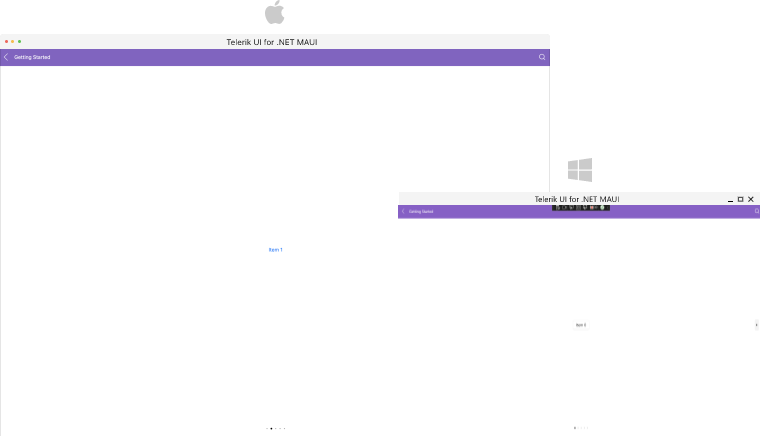
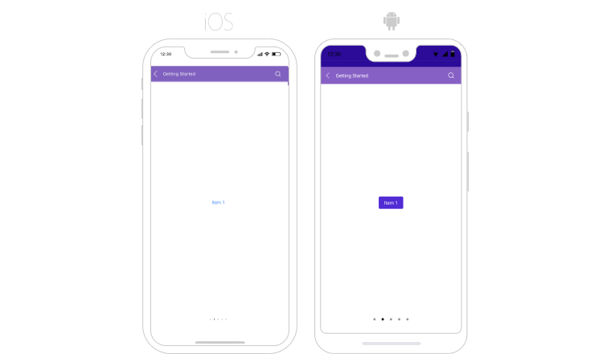

# Getting Started with .NET MAUI SlideView

This guide provides the information you need to start using Telerik UI for .NET MAUI SlideView by adding the control to your project.

At the end, you will be able to achieve the following result on Desktop platforms.



And the result on mobile platforms:




## Prerequisites

Before adding SlideView to your project, you need to:

1. [Set up your .NET MAUI application](#step-1-set-up-your-net-maui-application).

1. [Download Telerik UI for .NET MAUI](#step-2-download-telerik-ui-for-net-maui).

1. [Install Telerik UI for .NET MAUI](#step-3-install-telerik-ui-for-net-maui).

## Define the Control

**1.** When your .NET MAUI application is set up, you are ready to add a SlideView control to your page.

 <snippet id='slideview-getting-started-xaml' />

**2.** Add the following namespace:

```XAML
xmlns:telerik="http://schemas.telerik.com/2022/xaml/maui"
```

**3.** Register the Telerik controls through the `Telerik.Maui.Controls.Compatibility.UseTelerik` extension method called inside the `CreateMauiApp` method of the `MauiProgram.cs` file of your project:

 ```C#
 using Telerik.Maui.Controls.Compatibility;

 public static class MauiProgram
{
	public static MauiApp CreateMauiApp()
	{
		var builder = MauiApp.CreateBuilder();
		builder
			.UseTelerik()
			.UseMauiApp<App>()
			.ConfigureFonts(fonts =>
			{
				fonts.AddFont("OpenSans-Regular.ttf", "OpenSansRegular");
			});

		return builder.Build();
	}
 }           
 ```

## Additional Resources

- [.NET MAUI SlideView Product Page](https://www.telerik.com/maui-ui/slideview)
- [.NET MAUI SlideView Forum Page](https://www.telerik.com/forums/maui?tagId=1937)
- [Telerik .NET MAUI Blogs](https://www.telerik.com/blogs/mobile-net-maui)
- [Telerik .NET MAUI Roadmap](https://www.telerik.com/support/whats-new/maui-ui/roadmap)

## See Also

- [Binding SlideView to Data]()
- [Using Navigation Buttons in SlideView]()
- [Executing Commands on Slide Action]()
- [Handling the SlideView Events]()
- [Using an Item Template in SlideView]()
- [Changing the SlideView Appearance through a Control Template]()
- [Styling the SlideView Component]()
- [Styling the SlideView Indicators]()