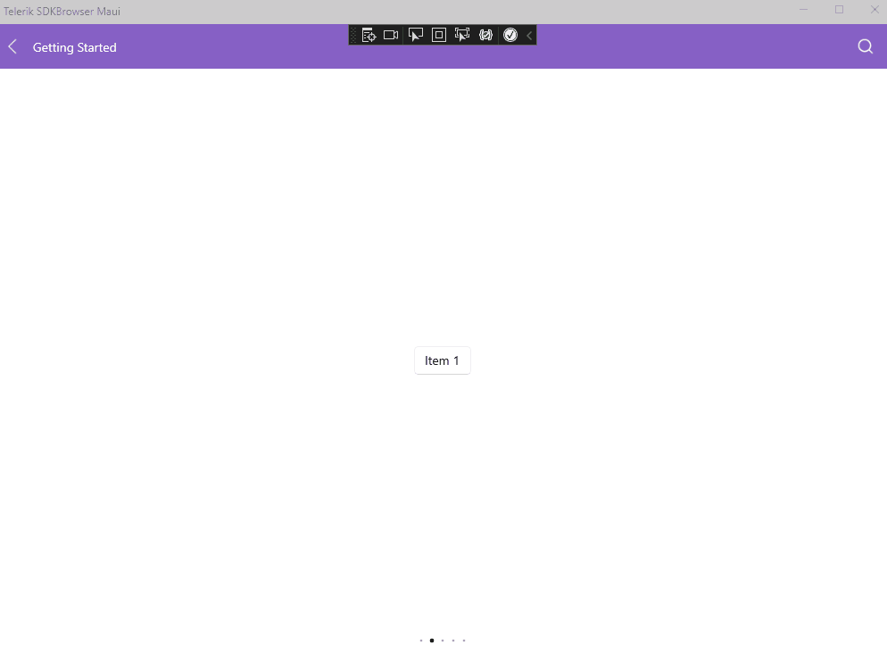

# .NET MAUI SlideView Infinite Looping

By default, when you reach the last view, the **Next** button won't do anything. You can change this behavior through the `Has Looping` property and allow the repeating of the views when the user reaches the last view.

`HasLooping`(Default value`False`)&mdash;This property allows to achieve infinite looping.

See the result below in the .gif file:

## See Also

- [Binding SlideView to Data]()
- [Using Navigation Buttons in SlideView]()
- [Executing Commands on Slide Action]()
- [Handling the SlideView Events]()
- [Using an Item Template in SlideView]()
- [Changing the SlideView Appearance through a Control Template]()
- [Styling the SlideView Component]()
- [Styling the SlideView Indicators]()
