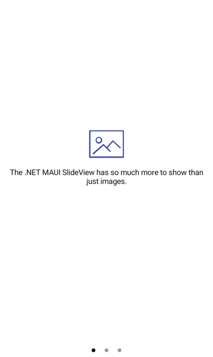

# .NET MAUI SlideView Item Template

You can populate the SlideView component with various types of objects, for example, `string`, `int`, business objects, and so on. To customize the visualization of the views in the `ItemsSource` of the control, use its `ItemTemplate` property. The template can contain any of the views that you use to display the data.

### Example

The following example shows how to populate the `ItemsSource` with business items and customize their appearance.

**1.** Create a sample `CustomItem` class. 

<snippet id='slideview-itemtemplate-datamodel' />

**2.** Add a View Model containing a collection of `MyItem` objects.

<snippet id='slideview-itemtemplate-viewmodel' />

**3.** Add the SlideView definition with a sample `ItemTemplate` applied.

<snippet id='slideview-item-template-xaml' />

**4.** Set the `BindingContext` to the View Model:

```C#
slideView.BindingContext = new ViewModel();
```

Here is the result:



> For a runnable example with the SlideView ItemTemplate scenario, see the [SDKBrowser Demo Application]() and go to **SlideView > Templates**.

## See Also

- [Binding SlideView to Data]()
- [Changing the SlideView Appearance through a Control Template]()
- [Styling the SlideView Indicators]()