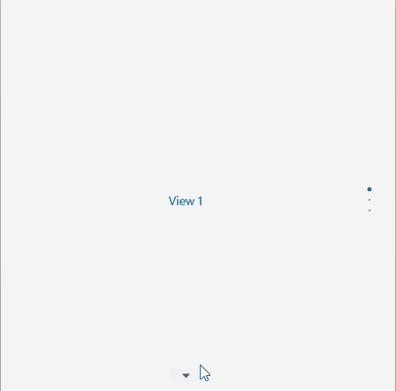

# Orientation 

The SlideView control exposes a `Orientation` property(enum of type `Telerik.Maui.Orientation`) which can change the orientation of the slides and the indicators. The property has two options:

* `Horizontal`
* `Vertical`

## Example

<snippet id='slideview-orientation-xaml' />

Add the ViewModel:

<snippet id='slideview-events-viewmodel' />

See the result in the image below:

> For a runnable example with the SlideView Orientation scenario, see the [SDKBrowser Demo Application]() and go to **SlideView > Features**.

## See Also

- [Binding SlideView to Data]()
- [Using Navigation Buttons in SlideView]()
- [Executing Commands on Slide Action]()
- [Handling the SlideView Events]()
- [Using an Item Template in SlideView]()
- [Changing the SlideView Appearance through a Control Template]()
- [Styling the SlideView Indicators]()
