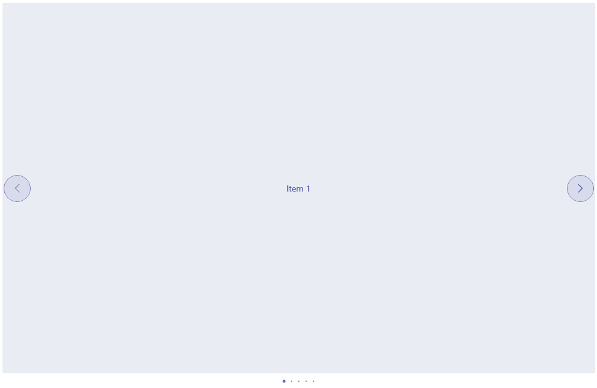

# .NET MAUI Navigation Buttons Styling

The SlideView control exposes styling properties that allow you to customize the Navigation Buttons:

* `NavigateToPreviousItemButtonStyle`(Style with target type `telerik:Radbutton`)&mdash;Defines the custom style that will be applied to the button leading to the previous item.

* `NavigateToNextItemButtonStyle`(Style with target type `telerik:Radbutton`)&mdash;Defines the custom style that will be applied to the button leading to the next item.

### Example

The following example demonstrates how to style the Navigation Buttons of the control.

<snippet id='slideview-navigation-styling-xaml' />

Add Style resources:

<snippet id='slideview-navigation-styling-resources' />

And the result below:

## See Also

- [Binding SlideView to Data]()
- [Using Navigation Buttons in SlideView]()
- [Executing Commands on Slide Action]()
- [Handling the SlideView Events]()
- [Using an Item Template in SlideView]()
- [Changing the SlideView Appearance through a Control Template]()
- [Styling the SlideView Indicators]()
