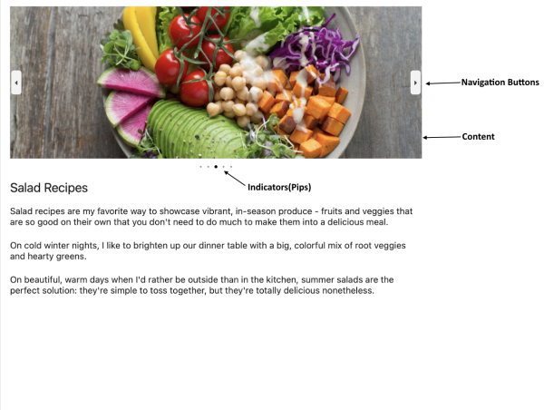

# .NET MAUI SlideView Visual Structure

This article describes all visual elements that are used in the SlideView for .NET MAUI.

## Legend

- `Navigation Buttons`&mdash;Navigation buttons used for changing the current item.
- `Indicator`&mdash;emphasizes changes from the current item to another item in a collection of items. Also incorporates buttons to enable the end user navigate between the next or previous items.

## See Also

- [Binding SlideView to Data]()
- [Using Navigation Buttons in SlideView]()
- [Executing Commands on Slide Action]()
- [Handling the SlideView Events]()
- [Using an Item Template in SlideView]()
- [Changing the SlideView Appearance through a Control Template]()
- [Styling the SlideView Indicators]()

