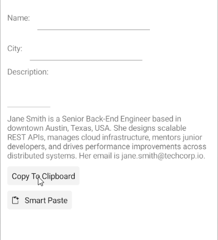

# .NET MAUI SmartPasteButton Command

The Telerik .NET MAUI SmartPasteButton exposes the `SmartPasteRequestCommand` (`ICommand`) which executes when a smart paste operation is requested. The command parameter is of type `Telerik.Maui.Controls.SmartPasteButton.SmartPasteButtonRequestContext`.

This is an example of how to bind the `SmartPasteRequestCommand` to a command in the ViewModel:

**1.** Define the editors on the page with two buttons one for copying the text to the clipboard and another one for the smart paste operation:

<snippet id='smartpastebutton-external-editor' />

**2.** Add the `telerik` namespace:

```XAML
xmlns:telerik="http://schemas.telerik.com/2022/xaml/maui"
```

**3.** Define a `ViewModel` that implements the `ISmartPasteButtonProvider` interface for the fields used by the SmartPasteButton, the `SmartPasteRequestCommand` and `CopyToClipboardCommand`:

<snippet id='smartpaste-viewmodel-external' />

This is the result on Android:



## See Also

- [Styling the SmartPasteButton]()
- [Visual States of the SmartPasteButton]()
- [Events of the SmartPasteButton]()
- [Configure the SmartPasteButton]()
