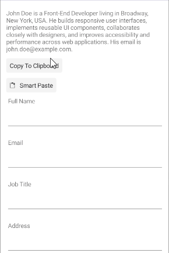

# .NET MAUI SmartPasteButton Events

The .NET MAUI SmartPasteButton emits a set of events that allow you to configure the component's behavior in response to specific user actions.

The .NET MAUI SmartPasteButton exposes the following events:

* `SmartPasteRequest`&mdash;Raised when the `RadSmartPasteButton` initiates a smart paste operation. The `SmartPasteRequest` event handler receives two parameters:
	* The `sender` argument which is of type `RadSmartPasteButton`.
	* A `SmartPasteButtonRequestContext` object which contains the clipboard content, fields, a cancellation token, and methods to signal the result of the AI request.

* `Clicked`&mdash;Raised when the `RadSmartPasteButton` is clicked. The `Clicked` event handler receives two parameters:
	* The `sender` argument which is of type `RadSmartPasteButton`.
	* An `EventArgs` object which provides information about the `Clicked` event.

* `Pressed`&mdash;Raised when `RadSmartPasteButton` is pressed (a finger presses on the button, or a mouse button is pressed with a pointer positioned over the button). The `Pressed` event handler receives two parameters:
	* The `sender` argument which is of type `RadSmartPasteButton`.
	* An `EventHandler` object which provides information about the `Pressed` event.

* `Released`&mdash;Raised when the `RadSmartPasteButton` is released (the finger or mouse button is released). The `Released` event handler receives two parameters:
	* The `sender` argument which is of type `RadSmartPasteButton`.
	* An `EventHandler` object which provides information about the `Released` event.

## Using the SmartPasteRequest Event

The following example demonstrates how to use the `SmartPasteRequest` event.

**1.** Define the button in XAML:

<snippet id='smartpastebutton-gettingstarted-xaml' />

**2.** Add the DataForm control to your page. The SmartPasteButton is designed to work with the DataForm control, allowing you to populate form fields with structured data extracted from unstructured text. By integrating the SmartPasteButton with the DataForm, you can enhance the user experience and streamline data entry processes within your application.

<snippet id='smartpastebutton-gettingstarted-dataform-xaml' />

**3.** Text from the clipboard is used for the smart paste operation.

<snippet id='smartpastebutton-gettingstarted-copy-xaml' />

**4.** Add the `telerik` namespace:

```XAML
xmlns:telerik="http://schemas.telerik.com/2022/xaml/maui"
```

**5.** The copy button's `Clicked` event handler:

<snippet id='smartpaste-gettingstarted-copy' />

**6.** The `SmartPasteRequest` event handler:

<snippet id='smartpaste-gettingstarted-paste-request' />

This is the result:



>important The SmartPasteButton examples in the [SDKBrowser Demo Application]() use a Telerik-hosted AI service for demonstration purposes only. 
>
>To use the smart paste functionality in your application, you must configure your own AI service.
>
>How to do that is described in the [Configuration]() article.

> For a runnable example demonstrating the SmartPasteButton `SmartPasteRequest` event, see the [SDKBrowser Demo Application]() and go to the **SmartPasteButton > Getting Started** category.

## See Also

- [Configure the SmartPasteButton]()
- [Set Visual States]()
- [Execute Command]()
- [Style the SmartPasteButton]()