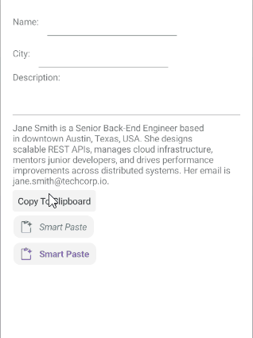

# .NET MAUI SmartPasteButton Styling

The SmartPasteButton provides a set of styling options by exposing properties for customizing its visual appearance.

## Styling the SmartPasteButton

To style the SmartPasteButton, you can use the following properties:

* `Background` (`Brush`)&mdash;Specifies the background brush of the control.
* `BorderBrush` (`Brush`)&mdash;Specifies the border brush of the control.
* `BorderColor` (`Color`)&mdash;Specifies the border color of the control.
* `BorderThickness` (`Thickness`)&mdash;Specifies the border thickness of the control.
* `CornerRadius` (`CornerRadius`)&mdash;Specifies the corner radius of the control.
* `Padding` (`Thickness`)&mdash;Specifies the padding of the control.
* `TextColor` (`Color`)&mdash;Specifies the color of the `Text`.
* `IconTextColor` (`Color`)&mdash;Specifies the color of the icon.

The SmartPasteButton uses the .NET MAUI Visual State Manager and defines a visual state group named `CommonStates` with the following visual states:

* `Normal`
* `MouseOver`
* `Pressed`
* `Disabled`
* `Processing`
* `ProcessingPressed`
* `ProcessingMouseOver`
* `ProcessingFocused`

### Using the Styling API

The following example demonstrates how to apply implicit and explicit styles to the SmartPasteButton using the visual states.

**1.** Define the buttons in XAML:

<snippet id='smartpastebutton-styling-implicit-xaml' />
<snippet id='smartpastebutton-styling-explicit-xaml' />

**2.** Define the explicit styling to the page's resources:

<snippet id='smartpastebutton-styling-explicit' />

**3.** Define the implicit styling to the page's resources:

<snippet id='smartpastebutton-styling-implicit' />

**4.** Add the `telerik` namespace:

```XAML
xmlns:telerik="http://schemas.telerik.com/2022/xaml/maui"
```

**5.** Define a `ViewModel` for the fields that will be used for the by the SmartPasteButton, and the `SmartPasteRequestCommand` and `CopyToClipboardCommand`: 

<snippet id='smartpaste-viewmodel-external' />

This is the result on WinUI:



>important The SmartPasteButton examples in the [SDKBrowser Demo Application]() use a Telerik-hosted AI service for demonstration purposes only. 
>
>To use the smart paste functionality in your application, you must configure your own AI service.
>
>How to do that is described in the [Configuration]() article.

> For a runnable example demonstrating the SmartPasteButton styling options, see the [SDKBrowser Demo Application]() and go to the **SmartPasteButton > Styling** category.

## See Also

- [Configure the SmartPasteButton]()
- [Set Visual States]()
- [Events]()
- [Execute Command]()
