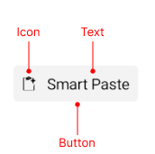

# .NET MAUI SmartPasteButton Visual Structure

The visual structure of the .NET MAUI SmartPasteButton represents the anatomy of the UI component. Being familiar with the visual elements of the SmartPasteButton allows you to quickly find the information required to configure them.

The following image shows the anatomy of the SmartPasteButton.

## Displayed Elements

## See Also

* [Getting Started]()
* [SmartPasteButton Command]()
* [SmartPasteButton Styling]()
