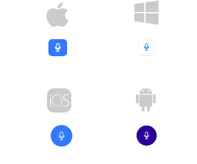

# Getting Started with the .NET MAUI SpeechToTextButton

This guide provides the information you need to start using the Telerik UI for .NET MAUI SpeechToTextButton by adding the control to your project.

At the end, you will achieve the following result.



## Prerequisites

Before adding the SpeechToTextButton, you need to:

1. [Set up your .NET MAUI application](#step-1-set-up-your-net-maui-application).

1. [Download Telerik UI for .NET MAUI](#step-2-download-telerik-ui-for-net-maui).

1. [Install Telerik UI for .NET MAUI](#step-3-install-telerik-ui-for-net-maui).

## Define the Control

**1.** When your .NET MAUI application is set up, you are ready to add a SpeechToTextButton control to your page:

<snippet id='speechtotext-getting-started-xaml' />
<snippet id='speechtotext-getting-started-csharp' />

**2.** Add the `telerik` namespace:

```XAML
xmlns:telerik="http://schemas.telerik.com/2022/xaml/maui"
```
```C#
using Telerik.Maui.Controls;
```

**3.** Register the Telerik controls through the `Telerik.Maui.Controls.Compatibility.UseTelerik` extension method called inside the `CreateMauiApp` method of the `MauiProgram.cs` file of your project:

```C#
using Telerik.Maui.Controls.Compatibility;
public static class MauiProgram
{
	public static MauiApp CreateMauiApp()
	{
		var builder = MauiApp.CreateBuilder();
		builder
			.UseTelerik()
			.UseMauiApp<App>()
			.ConfigureFonts(fonts =>
			{
				fonts.AddFont("OpenSans-Regular.ttf", "OpenSansRegular");
			});
		return builder.Build();
	}
}           
```

> For a runnable example with the SpeechToTextButton Getting Started scenario, see the [SDKBrowser Demo Application]() and go to the **SpeechToTextButton > Getting Started** category.

## Additional Resources

- [Configure the SpeechToTextButton]()
- [Set Visual States]()
- [Events]()
- [Execute Commands]()
- [Style the SpeechToTextButton]()

## See Also

- [.NET MAUI SpeechToTextButton Product Page](https://www.telerik.com/maui-ui/speechtotextbutton)
- [.NET MAUI SpeechToTextButton Forum Page](https://www.telerik.com/forums/maui?tagId=1764)
- [Telerik .NET MAUI Blogs](https://www.telerik.com/blogs/mobile-net-maui)
- [Telerik .NET MAUI Roadmap](https://www.telerik.com/support/whats-new/maui-ui/roadmap)