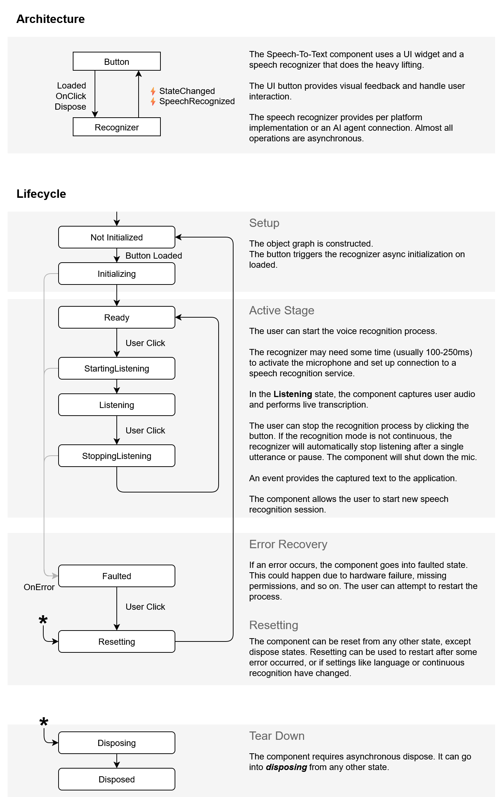

# .NET MAUI SpeechToTextButton Architecture and States

The SpeechTextButton control provides visual feedback and handle user interactions. The button uses a speech recognition service. The service provides per platform implementation or an AI agent conenction. Almost all operations are asynconous.

The SpeechToTextButton control in .NET MAUI has several states that reflect its current operation and user interaction. 

The image below explains how the control works and how the states are managed: 

## See Also

- [Set Visual States]()
- [Events]()
- [Execute Commands]()
- [Style the SpeechToTextButton]()