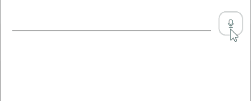

# .NET MAUI SpeechToTextButton Styling

The SpeechToTextButton for .NET MAUI provides extensive styling options that allow you to customize its visual appearance to match your application's design. You can modify colors, borders, spacing, and leverage visual states to provide clear feedback during different interaction phases.

## Styling Properties

The following properties control the visual appearance of the SpeechToTextButton:

* `Background` (`Brush`)&mdash;Specifies the background brush of the control.
* `BorderBrush` (`Brush`)&mdash;Specifies the border brush of the control.
* `BorderColor` (`Color`)&mdash;Specifies the border color of the control.
* `BorderThickness` (`Thickness`)&mdash;Specifies the border thickness of the control.
* `CornerRadius` (`CornerRadius`)&mdash;Specifies the corner radius of the control.
* `Padding` (`Thickness`)&mdash;Specifies the padding of the control.
* `TextColor` (`Color`)&mdash;Specifies the color of the button icon.

The SpeechToTextButton uses the .NET MAUI Visual State Manager and defines a visual state group named `CommonStates` with the following visual states:

* `Normal`&mdash;The default state when the button is not being interacted with and speech recognition is not active.
* `Pressed`&mdash;The state when the user is physically pressing the button but speech recognition hasn't started yet.
* `Listening`&mdash;The active state when the button is listening for speech input. This is the primary feedback state for users.
* `Error`&mdash;The state displayed when speech recognition encounters an error or fails to process input.
* `Disabled`&mdash;The state when the control is disabled and cannot be interacted with.

Each visual state can have different styling applied, allowing you to provide clear visual feedback for different interaction phases.

## Example

The following example demonstrates how to style the SpeechToTextButton with custom colors and visual state styling.

**1.** Define the SpeechToTextButton in XAML:

<snippet id='speechtotext-styling' />

**2.** Define the style in the page's resources:

<snippet id='speechtotext-styling-resource' />

**3.** Add the `telerik` namespace:

```XAML
xmlns:telerik="http://schemas.telerik.com/2022/xaml/maui"
```

This is the result on Android and iOS:



> For a runnable example demonstrating the SpeechToTextButton Styling API, see the [SDKBrowser Demo Application]() and go to the **SpeechToTextButton > Styling** category.

## See Also

- [Visual States in the SpeechToTextButton]()
- [Configure the SpeechToTextButton]()
- [Events]()
- [Execute Commands]()
