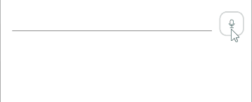

# .NET MAUI SpeechToTextButton Visual States

The SpeechToTextButton control provides visual states that allow you to customize its appearance based on different interaction and operational states. Visual states enable you to create responsive UI that provides clear feedback to users about the control's current status.

You can use visual states to change the visual appearance of the control depending on its current state&mdash;whether it's disabled, pressed, listening for speech, or encountering an error.

## Available Visual States

The SpeechToTextButton provides the following `CommonStates` visual states:

| Visual State | Description |
| ------------ | ----------- |
| `Normal` | Applied when the button is in its default, inactive state. |
| `Pressed` | Applied when the button is being pressed or tapped by the user. |
| `PointerOver`| (Desktop) Applied when the mouse cursor is hovering over the button. |
| `Listening` | Applied when the button is actively listening for speech input. |
| `ListeningPointerOver` | (Desktop) Applied when the mouse cursor is hovering over the button when in `Listening` state. |
| `ListeningPressed` | Applied when the button is pressed when actively listening for speech input. |
| `Error` | Applied when an error occurs during speech recognition (e.g., no internet connection, speech recognizer issues, permission denied). |
| `Disabled` | Applied when the button is disabled and cannot be interacted with. |

## Visual State Transitions

The SpeechToTextButton automatically transitions between visual states based on user interaction and speech recognition status:

- `Normal` → `Pressed`&mdash;When user starts pressing the button
- `Pressed` → `Listening`&mdash;When speech recognition begins
- `Listening` → `Normal`&mdash;When speech recognition completes successfully
- Any State → `Error`&mdash;When an error occurs during operation
- Any State → `Disabled`&mdash;When the control is programmatically disabled

## Using Visual States

The following example demonstrates how to customize the SpeechToTextButton visual states with different styling for each state.

**1.** Define the SpeechToTextButton in XAML:

<snippet id='speechtotext-styling' />

**2.** Define the visual states in the page's resources with custom styling:

<snippet id='speechtotext-styling-resource' />

**3.** Add the `telerik` namespace:

```XAML
xmlns:telerik="http://schemas.telerik.com/2022/xaml/maui"
```

This is the result on WinUI:



> For a runnable example demonstrating the SpeechToTextButton Visual States scenario, see the [SDKBrowser Demo Application]() and go to the **SpeechToTextButton > Styling** category.

## See Also

- [Style the SpeechToTextButton]()
- [Configure the SpeechToTextButton]()
- [Events]()
- [Execute Commands]()