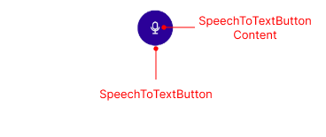

# .NET MAUI SpeechToTextButton Visual Structure

The visual structure of the .NET MAUI SpeechToTextButton represents the anatomy of the UI component. Being familiar with the visual elements of the SpeechToTextButton allows you to quickly find the information required to configure them.

The following image shows the anatomy of the SpeechToTextButton.

## Displayed Elements

* **Content**&mdash;The content of the SpeechToTextButton.

## See Also

- [Getting Started with Telerik UI for .NET MAUI SpeechToTextButton]()
- [Configure the SpeechToTextButton]()
- [Set Visual States]()
- [Events]()
- [Execute Commands]()
- [Style the SpeechToTextButton]()