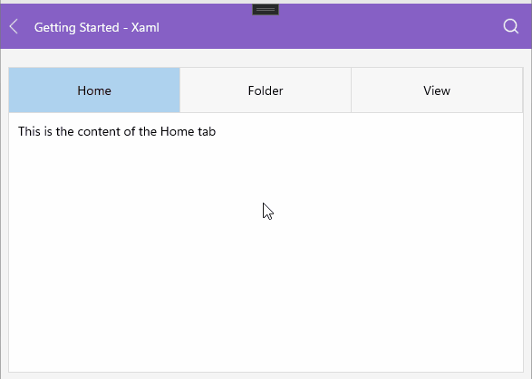

# .NET MAUI TabView Keyboard Navigation Support on Desktop

The [Telerik UI for .NET MAUI TabView]() provides keyboard navigation support on WinUI and MacCatalyst.

The table below lists the available keyboard combinations and their corresponding actions:

| Hotkey | Action |
| ------ | ------ |
| `Tab` | Enters or exits the TabView and focuses the selected tab (if selection is set&mdash; by default the first tab is selected). |
| `Left Arrow` | Navigates to the previous tab in the TabView. |
| `Right Arrow` | Navigates to the next tab in the TabView. |
| `Down Arrow` | Navigates to the next tab in the TabView&mdash;in vertical orientation. |
| `Up Arrow` | Navigates to the previous tab in the TabView&mdash;in vertical orientation. |
| `Enter` | Selects the currently focused tab. |
| `Space` | Selects the currently focused tab. |

Here is how the keyboard navigation support looks on WinUI:

## Setting CurrentItem

The TabView allows you to use the `CurrentItem` property of type `object` to programmatically modify the current item during keyboard navigation.

## See Also

- [TabViewItem]()
- [Styling]()
- [Templates]()