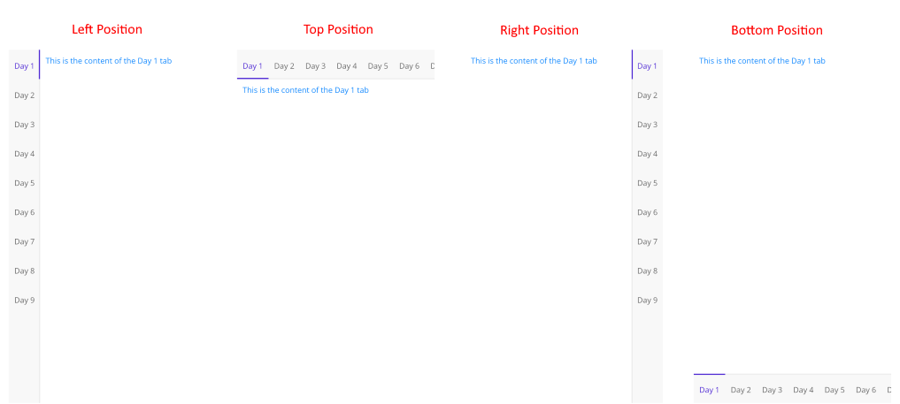
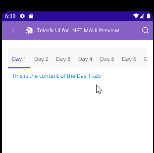

# Configure the .NET MAUI TabView

In this article we will review all configuration options that the TabView control provides. 

## Setting the Header's Position

Use the `HeaderPosition`(enum of type`Telerik.Maui.Controls.TabViewHeaderPosition`)property of the `RadTabView` to control the position of the header. 

The available options are: `Top`, `Bottom`, `Left` and `Right`.

```XAML
<telerik:RadTabView x:Name="tabView"
                    HeaderPosition="Left">
    <telerik:TabViewItem HeaderText="Home">
        <Label Margin="10" Text="This is the content of the Home tab" />
    </telerik:TabViewItem>
    <telerik:TabViewItem HeaderText="Folder">
        <Label Margin="10" Text="This is the content of the Folder tab" />
    </telerik:TabViewItem>
    <telerik:TabViewItem HeaderText="View">
        <Label Margin="10" Text="This is the content of the View tab" />
    </telerik:TabViewItem>
</telerik:RadTabView>
```




## Spacing between the header and the content

* Apply spacing in pixels between the header area and the content area using the `HeaderSpacing`(`double`)property.

```XAML
<telerik:RadTabView x:Name="tabView"
                    HeaderSpacing="20">
    <telerik:TabViewItem HeaderText="Home">
        <Label Margin="10" Text="This is the content of the Home tab" />
    </telerik:TabViewItem>
    <telerik:TabViewItem HeaderText="Folder">
        <Label Margin="10" Text="This is the content of the Folder tab" />
    </telerik:TabViewItem>
    <telerik:TabViewItem HeaderText="View">
        <Label Margin="10" Text="This is the content of the View tab" />
    </telerik:TabViewItem>
</telerik:RadTabView>
```

## Scrolling in the TabView Header

TabView control allows you to scroll through the tabs inside the TabView Header. 

To enable the scrolling use the `IsHeaderScrollable`(`bool`)property. The default value is `True`.


## Overlaid Header Area

* `IsHeaderOverlaid`(`bool`)&mdash;Indicates whether the header area is overlaid on top of the content area. 

When the `IsHeaderOverlaid` is set to `True`, the header area is centered and  overlaps with one of the borders of the content area, based on the value of the `HeaderPosition` property. The padding of the content area is adjusted so, to avoid overlapping with the header area.

When the `IsHeaderOverlaid` is set to `False`, the header area is placed next to the content area without any overlapping, based on the value of the `HeaderPosition` property.

## Swiping inside the TabView Content

 Change the selected item using swipe gesture. This allows you to change the selected item of the TabView.



If you want to prevent this feature you will need to set the `IsContentSwipingEnabled`(`bool`) property to `False`. The default value is `True`.

## See Also

- [TabViewItem]()
- [Selection]()
- [Styling]()
- [Templates]()