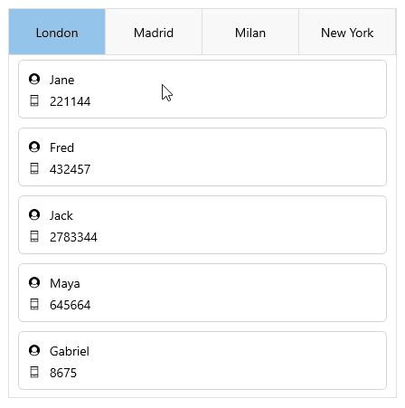

# .NET MAUI TabView Data Binding

For all cases where the business items are not simple strings, data-binding is necessary to correctly visualize information. The TabView for .NET MAUI component supports data binding starting with the Telerik .NET MAUI 7.0.0 version.

* `ItemsSource`(`IEnumerable`)&mdash;Defines the items source from which TabView items are generated.

In a combination with the `ItemsSource`, the developer has to define the `ItemTemplate`. The `ItemTemplate` (of type `DataTemplate`) is used to specify the template for the `TabViewItem`.

## Data Binding Example

Here is an example showing how to bind the TabView to a data source:

**1.** Define the TabView control:

<snippet id='tabview-data-binding' />

**2.** Define the data model class:

<snippet id='tabview-databinding-datamodel' />

**3.** Define the `ViewModel` class:

<snippet id='tabview-databinding-viewmodel' />

Here is the TabView after `DataBinding` scenario:

> For a runnable example with the TabView Data Binding scenario, see the [SDKBrowser Demo Application]() and go to **TabView > Features**.

## See Also

- [TabViewItem]()
- [Styling]()
- [Templates]()