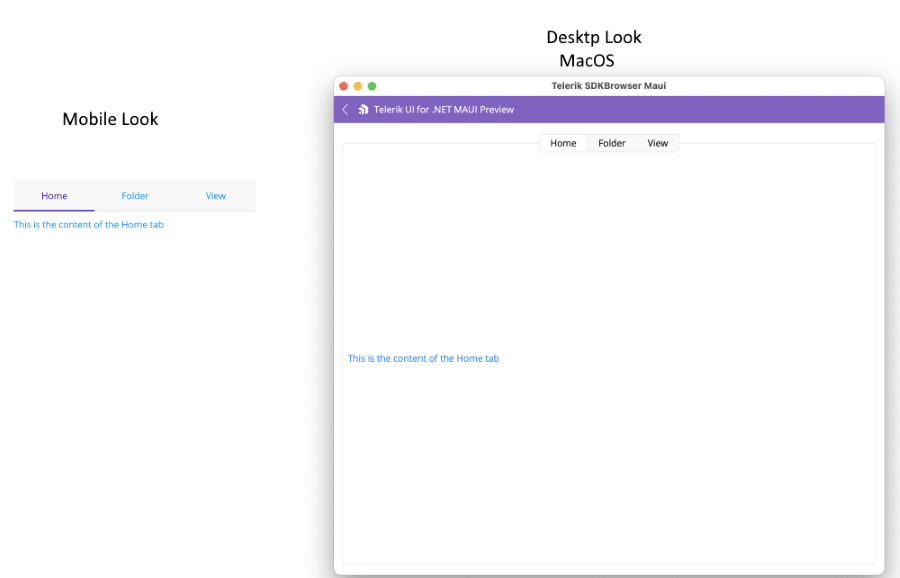

# Getting Started with the .NET MAUI TabView

This guide provides the information you need to start using the Telerik UI for .NET MAUI TabView by adding the control to your project.

At the end, you will achieve the following result.



## Prerequisites

Before adding the TabView, you need to:

1. [Set up your .NET MAUI application](#step-1-set-up-your-net-maui-application).

1. [Download Telerik UI for .NET MAUI](#step-2-download-telerik-ui-for-net-maui).

1. [Install Telerik UI for .NET MAUI](#step-3-install-telerik-ui-for-net-maui).

## Define the Control

**1.** When your .NET MAUI application is set up, you are ready to add a TabView control to your page.

* To display content in the tab, you can define `TabViewItem` elements in its `Items` collection.

* To define the header of a `TabViewItem` use its `HeaderText` property as in the example.

<snippet id='tabview-getting-started-xaml'/>

**2.** Add the following namespaces:

```XAML
xmlns:telerik="http://schemas.telerik.com/2022/xaml/maui" 
```

**3.** Register the Telerik controls through the `Telerik.Maui.Controls.Compatibility.UseTelerik` extension method called inside the `CreateMauiApp` method of the `MauiProgram.cs` file of your project:


 ```C#
using Telerik.Maui.Controls.Compatibility;

public static class MauiProgram
{
	public static MauiApp CreateMauiApp()
	{
		var builder = MauiApp.CreateBuilder();
		builder
			.UseTelerik()
			.UseMauiApp<App>()
			.ConfigureFonts(fonts =>
			{
				fonts.AddFont("OpenSans-Regular.ttf", "OpenSansRegular");
			});

		return builder.Build();
	}
}           
```

 
 > For a runnable example with the TabView Getting Started scenario, see the [SDKBrowser Demo Application]() and go to **TabView > Getting Started**.

## Additional Resources

- [.NET MAUI TabView Product Page](https://www.telerik.com/maui-ui/tabview)
- [.NET MAUI TabView Forum Page](https://www.telerik.com/forums/maui?tagId=1871)
- [Telerik .NET MAUI Blogs](https://www.telerik.com/blogs/mobile-net-maui)
- [Telerik .NET MAUI Roadmap](https://www.telerik.com/support/whats-new/maui-ui/roadmap)
