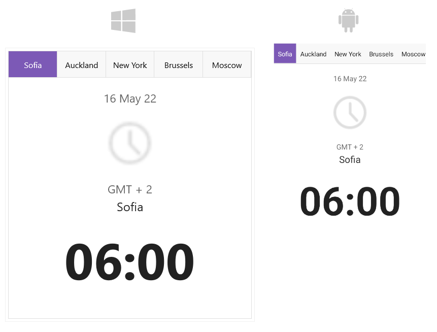

# Overview

**Telerik TabView for .NET MAUI** is a flexible navigation control that allows you to build tabbed interfaces. Each tabview item has an associated content displayed on selection. The control is fully customizable. Using the API you can easily customize the TabView header area that contains the tabs and the TabView content.

 

## Key Features

* [Item Selection]()&mdash;TabView exposes selection API which allows you as a developer to extend the navigation per application needs.
* [Header Customization]()&mdash;TabView provides means for fully customizing the header area containing the tabs - through `HeaderStyle` property you can change its position, orientation and spacing between the tabs, through `HeaderTemplate` property you can completely modify its look &amp; feel.
* [Image support in the header]()&mdash;Easily add images inside the header. In addition you can controls the position of the image and the spacing between the image and the header text.
* [Change the header position]() to top, bottom, left or right. 
* [Tabs Customization]()&mdash;You can fully customize the appearance of each tab. Each tab has a header and content. The `TabViewItem` class gives you the option to set Tab's header text, add an image which will be displayed in the header, add a content and decide whether the tab will be selected, visible and enabled.

## Next Steps

- [Getting Started with Telerik UI for .NET MAUI TabView]()
